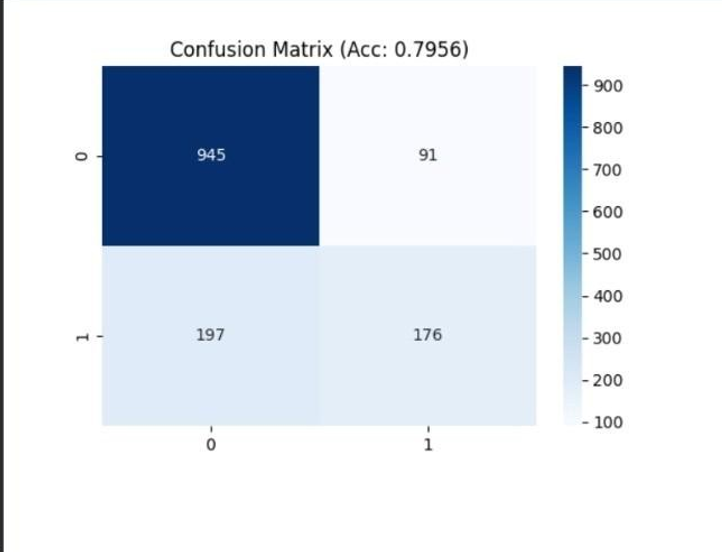
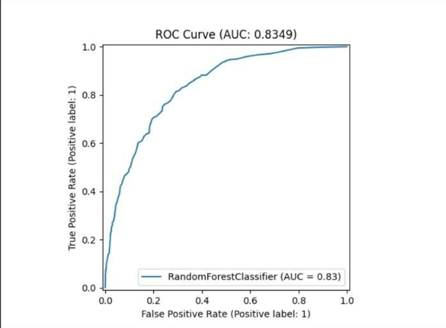

# 🚀 Production-Grade Customer Churn Prediction

### End-to-End MLOps Pipeline with Git • DVC • MLflow • Airflow • DAGsHub • FastAPI • Docker

<p align="center">

**A complete, reproducible and production-oriented Machine Learning system for predicting customer churn**

</p>

---

## 📌 Project Overview

Customer churn is one of the most important business problems for subscription-based companies.

This project builds an **end-to-end Customer Churn Prediction system** that goes beyond a traditional machine learning notebook.

The system covers the complete ML lifecycle:

```text
Data
  ↓
Data Ingestion
  ↓
Data Validation
  ↓
Feature Engineering
  ↓
Model Training
  ↓
Model Evaluation
  ↓
Experiment Tracking
  ↓
Model Registration
  ↓
REST API Deployment
  ↓
Dockerized Production Service
```

The entire workflow is automated and orchestrated using **Apache Airflow**, while **DVC** provides data/pipeline versioning and **MLflow** provides experiment tracking and model evaluation.

The final trained model is exposed through a **FastAPI REST API**, allowing real-time customer churn predictions.

---

# 🎯 Project Objective

The primary objective is to develop a machine learning system capable of predicting whether a customer is likely to leave a subscription-based telecom service.

### Business Question

> **"Is this customer likely to churn?"**

The system returns:

```json
{
  "churn_probability": 0.35,
  "prediction": "No"
}
```

This enables a business to identify high-risk customers and potentially take retention actions before churn occurs.

---

# 🏆 Key Features

| Feature                    | Implementation                           |
| -------------------------- | ---------------------------------------- |
| Data ingestion             | Python                                   |
| Data preprocessing         | pandas / scikit-learn                    |
| Feature engineering        | Python                                   |
| Machine Learning           | scikit-learn / XGBoost                   |
| Model comparison           | Multiple classification models           |
| Experiment tracking        | MLflow                                   |
| Data & pipeline versioning | DVC                                      |
| Workflow orchestration     | Apache Airflow                           |
| Remote repository          | Git / DAGsHub                            |
| REST API                   | FastAPI                                  |
| API documentation          | Swagger / OpenAPI                        |
| Containerization           | Docker                                   |
| Model evaluation           | Accuracy, Precision, Recall, F1, ROC-AUC |
| Visualization              | Confusion Matrix + ROC Curve             |
| Optional bonus             | LLM-based retention incentive            |

---

# 🧠 Machine Learning Problem

This is a **binary classification problem**.

### Target Variable

```text
Churn
```

Possible values:

```text
Yes
No
```

The model predicts whether a customer will churn based on demographic, service, contract and billing information.

---

# 📊 Dataset

The project uses the:

```text
telco_customer_churn_data.csv
```

The dataset contains **7,043 customers** and **21 attributes** covering customer demographics, subscription information, services, billing and churn status.

### Important Features

```text
customerID
gender
SeniorCitizen
Partner
Dependents
tenure
PhoneService
MultipleLines
InternetService
OnlineSecurity
OnlineBackup
DeviceProtection
TechSupport
StreamingTV
StreamingMovies
Contract
PaperlessBilling
PaymentMethod
MonthlyCharges
TotalCharges
Churn
```

---

# 🔄 Data Engineering Pipeline

The preprocessing workflow includes:

### 1. Missing Value Handling

Missing values are identified and handled before model training.

### 2. TotalCharges Conversion

`TotalCharges` is processed correctly as a numerical feature.

### 3. Categorical Encoding

Categorical variables are transformed into machine-readable numerical representations.

### 4. Numerical Feature Scaling

Numerical variables are scaled where required.

### 5. Train/Test Split

The dataset is separated into training and testing subsets to evaluate generalization performance.

---

# 🤖 Model Development

Multiple classification algorithms are considered as part of the model development workflow:

### Models

```text
1. Logistic Regression
2. Random Forest
3. XGBoost / Gradient Boosting
```

The models are evaluated using:

```text
Accuracy
Precision
Recall
F1 Score
ROC-AUC
```

This allows the best-performing model to be selected based on more than a single metric.

---

# 📈 Model Performance

The evaluated **Random Forest Classifier** achieved the following results:

| Metric    |      Score |
| --------- | ---------: |
| Accuracy  | **79.56%** |
| Precision | **65.92%** |
| Recall    | **47.18%** |
| F1 Score  | **55.00%** |
| ROC-AUC   | **83.49%** |

### Performance Interpretation

The model achieved an **ROC-AUC of 0.8349**, indicating good ability to distinguish between customers who churn and customers who do not churn.

The accuracy is approximately **79.56%**.

The recall of approximately **47.18%** also highlights an important area for future improvement: increasing the model's ability to detect actual churners.

---

# 📊 Confusion Matrix

The confusion matrix provides a detailed view of the model's classification performance.



### Observed Results

```text
True Negative  = 945
False Positive = 91
False Negative = 197
True Positive  = 176
```

This gives a clear picture of where the model correctly identifies customers and where it makes prediction errors.

---

# 📈 ROC Curve



### ROC-AUC

```text
ROC-AUC = 0.8349
```

The ROC curve demonstrates the model's discrimination capability across different classification thresholds.

---

# 🧪 MLflow Experiment Tracking

**MLflow** is used to track the machine learning lifecycle.

The project records model evaluation information such as:

```text
Accuracy
Precision
Recall
F1 Score
ROC-AUC
```

MLflow also provides a central location for experiment results and model-related artifacts.

### MLflow Dashboard


### Run MLflow Locally

```bash
mlflow ui
```

Then open:

http://localhost:5000
```

> ⚠️ The `localhost` URL is a local development/demo URL. It will only work while MLflow is running on your computer.

---

# 🔁 DVC — Data & Pipeline Versioning

**DVC (Data Version Control)** is used to make the machine learning workflow reproducible.

The repository contains:

```text
dvc.yaml
dvc.lock
```

### Pipeline

```text
┌─────────────────────┐
│   Data Ingestion    │
└──────────┬──────────┘
           ↓
┌─────────────────────┐
│    Preprocessing    │
└──────────┬──────────┘
           ↓
┌─────────────────────┐
│   Model Training    │
└──────────┬──────────┘
           ↓
┌─────────────────────┐
│     Evaluation      │
└─────────────────────┘
```

### Reproduce the pipeline

```bash
dvc repro
```

DVC helps ensure that the data processing and model development workflow can be reproduced consistently.

---

# 🌬️ Apache Airflow — Workflow Orchestration

Apache Airflow is responsible for orchestrating the complete ML workflow.

The implemented DAG contains the following stages:

```text
data_ingestion
       ↓
data_validation
       ↓
feature_engineering
       ↓
model_training
       ↓
model_evaluation
       ↓
model_registration
```

### Airflow DAG


All stages are connected using task dependencies and are executed as a single automated workflow.

### Airflow Local UI


http://localhost:8080
```

If using Astronomer:

```bash
astro dev start
```

Then open the Airflow interface and trigger the customer churn DAG.

> ⚠️ `localhost:8080` is a local development URL and is accessible only while the Airflow environment is running.

---

# 🔗 MLOps Architecture

The complete system can be represented as:

```text
                         ┌──────────────────────┐
                         │   Customer Dataset   │
                         │ telco_customer_      │
                         │ churn_data.csv       │
                         └──────────┬───────────┘
                                    │
                                    ▼
                         ┌──────────────────────┐
                         │   Data Ingestion     │
                         └──────────┬───────────┘
                                    │
                                    ▼
                         ┌──────────────────────┐
                         │   Data Validation    │
                         └──────────┬───────────┘
                                    │
                                    ▼
                         ┌──────────────────────┐
                         │ Feature Engineering  │
                         └──────────┬───────────┘
                                    │
                                    ▼
                 ┌─────────────────────────────────────┐
                 │            Model Training             │
                 │                                     │
                 │ Logistic Regression                 │
                 │ Random Forest                       │
                 │ XGBoost / Gradient Boosting         │
                 └──────────────────┬──────────────────┘
                                    │
                                    ▼
                         ┌──────────────────────┐
                         │   Model Evaluation   │
                         └──────────┬───────────┘
                                    │
              ┌─────────────────────┼─────────────────────┐
              │                     │                     │
              ▼                     ▼                     ▼
        ┌───────────┐         ┌───────────┐        ┌───────────┐
        │   DVC     │         │  MLflow   │        │  Airflow  │
        │ Versioning│         │ Tracking  │        │Orchestration│
        └─────┬─────┘         └─────┬─────┘        └─────┬─────┘
              │                     │                     │
              └─────────────────────┼─────────────────────┘
                                    │
                                    ▼
                         ┌──────────────────────┐
                         │   Model Registry /   │
                         │   Best Model        │
                         └──────────┬───────────┘
                                    │
                                    ▼
                         ┌──────────────────────┐
                         │      FastAPI         │
                         │     REST API         │
                         └──────────┬───────────┘
                                    │
                                    ▼
                         ┌──────────────────────┐
                         │   POST /predict      │
                         └──────────┬───────────┘
                                    │
                                    ▼
                         ┌──────────────────────┐
                         │ Churn Probability +  │
                         │ Prediction            │
                         └──────────────────────┘
```

---

# ⚡ FastAPI REST API

The trained model is deployed through **FastAPI**.

### Endpoint

```http
POST /predict
```

### Example Request

```json
{
  "gender": "Female",
  "SeniorCitizen": 0,
  "Partner": "Yes",
  "Dependents": "No",
  "tenure": 1,
  "PhoneService": "No",
  "MultipleLines": "No phone service",
  "InternetService": "DSL",
  "OnlineSecurity": "No",
  "OnlineBackup": "Yes",
  "DeviceProtection": "No",
  "TechSupport": "No",
  "StreamingTV": "No",
  "StreamingMovies": "No",
  "Contract": "Month-to-month",
  "PaperlessBilling": "Yes",
  "PaymentMethod": "Electronic check",
  "MonthlyCharges": 29.85,
  "TotalCharges": 29.85
}
```

### Example Response

```json
{
  "churn_probability": 0.35,
  "prediction": "No"
}
```

---

# 🖥️ Live API Demonstration


The screenshot demonstrates a successful live request to:

```text
POST http://localhost:8000/predict
```

with a successful:

```text
HTTP 200
```

response.

### Start the API

```bash
python app.py
```

Then open:


http://localhost:8000
```

### Swagger Documentation

```text
http://localhost:8000/docs
```

FastAPI automatically provides interactive API documentation through Swagger UI.

---

# 🐳 Docker Deployment

The project includes a `Dockerfile` to package the API into a portable container.

### Build Docker Image

```bash
docker build -t churn-prediction-mlops .
```

### Run Container

```bash
docker run -p 8000:8000 churn-prediction-mlops
```

Then access:


http://localhost:8000/docs
```

This makes the API environment easier to reproduce across different machines.

---

# 🌐 Git + DAGsHub Integration

The project uses Git for source-code version control and DAGsHub as the collaboration/remote MLOps platform.

The intended workflow is:

```text
                 Git Repository
                      │
          ┌───────────┴───────────┐
          │                       │
          ▼                       ▼
      Source Code               DVC
                                  │
                                  ▼
                            Versioned Data
                                  │
                                  ▼
                              DAGsHub
                                  │
                     ┌────────────┴────────────┐
                     │                         │
                     ▼                         ▼
                  MLflow                   Artifacts
                Experiments
```

The final repository should demonstrate the connection between:

* Git commits
* DVC-tracked data
* DVC pipeline
* MLflow experiments
* MLflow artifacts
* Airflow workflow
* API deployment

---

# 📁 Project Structure

```text
churn-prediction-mlops/
│
├── .dvc/
│
├── dags/
│   ├── churn_dag.py
│   └── exampledag.py
│
├── src/
│   ├── data_ingestion.py
│   ├── preprocessing.py
│   ├── train.py
│   └── evaluate.py
│
├── models/
│   └── model.pkl
│
├── tests/
│   └── dags/
│
├── docs/
│   └── screenshots/
│       ├── airflow_dag_graph.png
│       ├── confusion_matrix.png
│       ├── fastapi_predict_full.png
│       ├── mlflow_experiment_eval.png
│       └── roc_curve.png
│
├── app.py
├── bonus_llm.py
├── dvc.yaml
├── dvc.lock
├── metrics.txt
├── requirements.txt
├── Dockerfile
└── README.md
```

---

# 🚀 Installation & Setup

## 1. Clone the Repository

```bash
gh repo clone cit-23-02-0104-creator/churn-prediction-mlops
```

---

## 2. Create Virtual Environment

### Windows

```bash
python -m venv venv
venv\Scripts\activate
```

### Linux / macOS

```bash
python3 -m venv venv
source venv/bin/activate
```

---

## 3. Install Dependencies

```bash
pip install -r requirements.txt
```

---

## 4. Reproduce the DVC Pipeline

```bash
dvc repro
```

---

## 5. Start FastAPI

```bash
python app.py
```

Open:

```text
http://localhost:8000/docs
```

---

## 6. Start MLflow

```bash
mlflow ui
```

Open:

```text
http://localhost:5000
```

---

## 7. Start Airflow

Using Astronomer:

```bash
astro dev start
```

Open:

```text
http://localhost:8080
```

---

# 🧪 Example End-to-End Workflow

A complete run looks like this:

```text
1. Dataset
      ↓
2. Data Ingestion
      ↓
3. Data Validation
      ↓
4. Feature Engineering
      ↓
5. Train Models
      ↓
6. Evaluate Models
      ↓
7. Log Metrics to MLflow
      ↓
8. Track Pipeline/Data with DVC
      ↓
9. Orchestrate through Airflow
      ↓
10. Register/Select Model
      ↓
11. Serve through FastAPI
      ↓
12. Dockerize
      ↓
13. Predict Customer Churn
```

---

# 🧠 Optional Bonus — LLM Retention Incentive

An optional LLM-based component can generate personalized retention incentives for customers predicted to churn.

Example concept:

```text
Model Prediction
      ↓
Churn = Yes
      ↓
Customer Profile
      ↓
LLM Prompt
      ↓
Personalized Retention Incentive
```

Example:

```text
Dear customer,

As a valued customer with 36 months of tenure,
we are pleased to offer you a personalized loyalty
discount together with a complimentary streaming upgrade.
```

The purpose of this component is to demonstrate how machine learning predictions can be connected to an intelligent business-action layer.

---
# 📊 Evaluation Summary

```text
                    MODEL PERFORMANCE
                    ─────────────────

Accuracy             79.56%
Precision            65.92%
Recall               47.18%
F1 Score             55.00%
ROC-AUC              83.49%
```

### Key Observation

The model demonstrates good overall discrimination with an ROC-AUC of **0.8349**.

However, the recall score indicates that improving the detection of actual churn customers would be a valuable next step.

Potential future improvements include:

```text
• Hyperparameter tuning
• Class imbalance handling
• Threshold optimization
• Feature selection
• Advanced ensemble models
• Cross-validation
• Better calibration
• Cost-sensitive learning
```

---

# 🔐 Security & Configuration

Sensitive information should **never** be committed to GitHub.

Do not commit:

```text
.env
API keys
Passwords
Access tokens
Cloud credentials
Private secrets
```

Use environment variables or a secrets-management solution for sensitive configuration.

---

# 🎥 Final Demo Checklist

The project is designed to demonstrate the complete MLOps workflow during the final presentation.

### Code Explanation

* [ ] Project structure
* [ ] Data pipeline
* [ ] DVC pipeline
* [ ] MLflow tracking
* [ ] Airflow DAG
* [ ] DAGsHub integration
* [ ] FastAPI implementation
* [ ] Docker configuration

### Live Demonstration

* [ ] Run Airflow DAG
* [ ] Show successful DAG execution
* [ ] Show MLflow experiment
* [ ] Show metrics
* [ ] Show confusion matrix
* [ ] Show ROC curve
* [ ] Show DVC pipeline/versioning
* [ ] Show DAGsHub repository
* [ ] Run `/predict`
* [ ] Show API response
* [ ] Demonstrate Docker deployment

### Presentation

* [ ] Code visible
* [ ] System running
* [ ] Live API prediction
* [ ] Face visible during presentation
* [ ] Keep demonstration within the required time

---

# 📋 Assignment Requirement Mapping

| Assignment Requirement | Implementation                                                  |
| ---------------------- | --------------------------------------------------------------- |
| Git                    | Git repository                                                  |
| Data Engineering       | Ingestion + preprocessing                                       |
| Missing Value Handling | Preprocessing pipeline                                          |
| Categorical Encoding   | Feature engineering                                             |
| Numerical Scaling      | Preprocessing                                                   |
| Train/Test Split       | ML pipeline                                                     |
| 3+ Models              | Logistic Regression + Random Forest + XGBoost/Gradient Boosting |
| Accuracy               | ✅                                                               |
| Precision              | ✅                                                               |
| Recall                 | ✅                                                               |
| F1 Score               | ✅                                                               |
| ROC-AUC                | ✅                                                               |
| Confusion Matrix       | ✅                                                               |
| ROC Curve              | ✅                                                               |
| MLflow                 | ✅                                                               |
| DVC                    | ✅                                                               |
| Airflow                | ✅                                                               |
| DAGsHub                | ✅                                                               |
| FastAPI                | ✅                                                               |
| Docker                 | ✅                                                               |
| REST `/predict`        | ✅                                                               |
| LLM Bonus              | `bonus_llm.py`                                                  |

---

# 🌟 Why This Project Is More Than a Machine Learning Model

This project does not stop at:

```text
Train Model → Predict
```

Instead, it demonstrates a complete engineering lifecycle:

```text
DATA
 │
 ▼
VERSION
 │
 ▼
PROCESS
 │
 ▼
TRAIN
 │
 ▼
TRACK
 │
 ▼
EVALUATE
 │
 ▼
ORCHESTRATE
 │
 ▼
REGISTER
 │
 ▼
DEPLOY
 │
 ▼
SERVE
 │
 ▼
MONITOR / IMPROVE
```

This architecture demonstrates the transition from a traditional **Data Science workflow** to a reproducible **MLOps workflow**.

---

# 🔮 Future Improvements

Possible future enhancements include:

* Automated model retraining
* CI/CD integration
* Model monitoring
* Data drift detection
* Model drift detection
* Automated hyperparameter tuning
* Better class-imbalance handling
* Cloud deployment
* Kubernetes deployment
* Model serving with MLflow
* Automated API testing
* Prometheus/Grafana monitoring
* Automated retention-offer generation
* Feature store integration

---

# 👨‍💻 Author

**Jayani samarakoon**

### Customer Churn Prediction — Production-Grade MLOps Project

Built using:

```text
Python
Git
DVC
MLflow
Apache Airflow
DAGsHub
FastAPI
Docker
Scikit-learn
XGBoost
```

---

⭐ If You Found This Project Interesting

This project demonstrates an end-to-end approach to building, tracking, orchestrating and deploying a machine learning system.

Machine Learning + MLOps + Automation + Deployment

                 🚀 CUSTOMER CHURN MLOPS 🚀

       Data → DVC → ML → MLflow → Airflow
                         ↓
                    DAGsHub
                         ↓
                  FastAPI → Docker
                         ↓
                 Real-Time Prediction
🔗 Project Links
GitHub
https://github.com/cit-23-02-0104-creator/churn-prediction-mlops

DAGsHub
https://dagshub.com/cit-23-02-0104-creator

Local Services

FastAPI / Swagger
http://localhost:8000/docs

MLflow
http://localhost:5000

Airflow
http://localhost:8080

Note: Localhost links are intended for local demonstration only. They are not publicly accessible GitHub URLs unless the services are separately deployed online.


